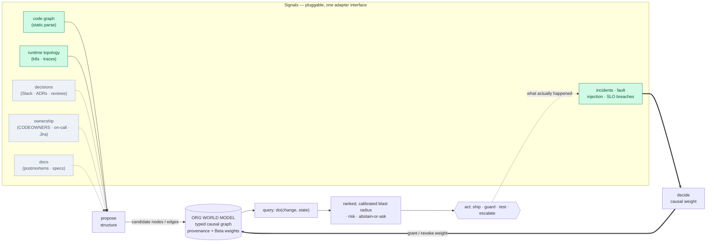
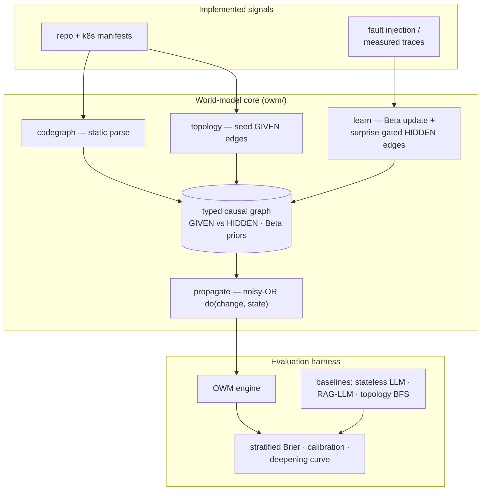

# Org World Model (OWM)

*A living, causal model of how a software organization's system actually behaves — assembled from many signals, queryable with interventions, and sharpening with every incident.*

[](https://github.com/swapnildahiphale/org-world-model/actions/workflows/ci.yml)
[](LICENSE)


A senior engineer's most valuable knowledge isn't the code in front of them — a model can read that. It's the **causal model in their head**: what breaks if you touch *this*, which service is fragile under load, which config flag silently couples two teams, which "safe" change took down checkout last spring. That model is assembled from years of heterogeneous signals and **deepens with every outage**.

The **Org World Model** makes that model explicit, shared, and queryable. It fuses an organization's signals — code, runtime topology, incidents, decisions, ownership, docs — into **one typed causal graph** you can interrogate with interventions (`do(change) →` consequences), and that **gets better over time** because every real outcome updates it. It is the persistent, system-specific substrate that today's stateless AI tools lack.

---

## Why a world model, not a bigger prompt

Today's AI engineering tools are **stateless decoders**: every prompt, they re-derive an understanding of your system from text, act, and forget. They hold no persistent model of *your* system and they don't learn from *your* incidents. Retrieval/RAG lets them fetch the **observable** layer — the code, the docs, past tickets — but it structurally cannot accumulate a **causal model of consequences**.

An Org World Model is a different kind of object:

- **Persistent** — one model that lives *between* questions and *across* changes, not a context window that resets.
- **Causal & intervention-capable** — you ask `do(change)`, not just "what's textually related?"
- **State-aware** — the *same* change has a *different* blast radius on a healthy vs. an already-saturated system; the model conditions on current state.
- **Calibrated** — it reports how sure it is, and (on the roadmap) abstains and asks a human when it isn't.
- **Self-deepening** — every outcome refines it; a *surprise* (something it judged safe that broke) teaches it a coupling it never knew. A stateless model, handed the same logs, retains nothing.

---

## Architecture — the Org World Model

The model is a **substrate**, not a single feature: many signals flow in, become one causal graph, and that graph answers intervention queries whose outcomes flow back in and sharpen it. New signal sources plug in behind **one adapter interface**, so the model grows richer without its core changing.



<sub>Green = implemented today · grey = future signals behind the same interface.</sub>

### The core principle: *signals propose, outcomes decide*

This single rule is what keeps OWM a **world model** and not "RAG over your wiki":

- **Structural and decision signals** — code, topology, Slack/ADRs, CODEOWNERS, postmortems — may *propose* nodes and edges: a plausible dependency, an ownership boundary, a documented gotcha.
- **Only outcome signals** — incidents, fault injections, SLO breaches — *grant or revoke causal weight*. The model believes what the running system **demonstrates**, not what a document asserts.

Every edge carries **provenance** (was this structure *given* to us, or *learned* from an outcome?) and a **Beta-distributed weight** (a confidence *and* an uncertainty) — so the model knows what it knows, and how well.

### The query: `do(change, state) → blast radius`

Given a proposed change and the current system state, the model forward-propagates over the weighted graph (noisy-OR) to a **ranked, probabilistic blast radius** — *"these services are at risk, in this order, with these probabilities"* — plus calibrated confidence and, on the roadmap, an explicit **abstain / ask-a-human** option when it is unsure.

### The loop: deepening

Each outcome updates the relevant Beta posteriors. When reality **surprises** the model, it adds a new **HIDDEN** edge — a coupling invisible to static structure — and the next related change catches it. The model *deepens*; that is the property a stateless decoder cannot have.

---

## What's implemented today

This repository is a **focused vertical slice** of that architecture — deliberately scoped to prove the hard part end-to-end (*learn a coupling you were never given, and report calibrated confidence*) on a **real microservice system**, Google's [Online Boutique](https://github.com/GoogleCloudPlatform/microservices-demo).



| Capability | Status |
|---|---|
| **Signals** — code graph (static parse), runtime topology (k8s), incidents (fault injection / measured traces) | ✅ implemented |
| **Signals** — decisions (Slack/ADRs), ownership (CODEOWNERS/Jira/on-call), docs (postmortems/specs) | ⬜ future — same *propose/decide* interface |
| Typed causal graph · GIVEN/HIDDEN provenance · Beta-distributed weights | ✅ |
| `do(change, state)` blast-radius propagation — noisy-OR, state-gated, with mitigating controls | ✅ |
| Deepening — Beta-posterior updates + surprise-gated HIDDEN edges (+ a learning-disabled ablation) | ✅ |
| Evaluation — provenance-stratified Brier, equal-frequency reliability, deepening curve, LLM/BFS baselines | ✅ |
| Calibrated abstention / risk–coverage (AURC) | ⬜ roadmap |
| k-fold over many hidden couplings · bootstrapped CIs · multi-app scale · web view | ⬜ roadmap |

The full module breakdown lives in [`docs/architecture-diagrams.md`](docs/architecture-diagrams.md).

---

## Does it work? — validation on a real system

The central claim — *a deepening causal model beats a stateless LLM at predicting consequences, by learning a coupling it was never given* — is **pre-registered** ([PREREGISTRATION.md](PREREGISTRATION.md)) and tested against **measured** ground truth, not authored by us.

On Online Boutique deployed to a real EKS cluster, we injected a hidden latency coupling (`EXTRA_LATENCY` on productcatalogservice) and **measured** the blast radius from distributed traces. Measured blast set = {frontend, recommendationservice}; one service that topology would have implicated (checkoutservice) was empirically *excluded*. Scored against **real Opus** (claude-opus-4-8, n=5 self-consistency):

| predictor | HIDDEN-stratum Brier (lower is better) |
|---|---:|
| **OWM engine** (after learning 1 incident) | **0.013** |
| Opus + RAG (handed the incident history) | 0.027 |
| topology BFS / engine *before* learning | 0.083 |
| stateless Opus | 0.127 |

**Deepening:** `0.083 → 0.013` after a single incident. **Ablation:** with learning disabled it stays flat at `0.083` — proving the gain is the *learning*, not the seed graph or the propagation math. All four pre-registered win conditions pass.


Full methodology, honest limits, and reproduce steps: **[RESULTS.md](RESULTS.md)**.

---

## Installation

```bash
pip install -e .            # core (graph + propagation + evaluation)
pip install -e ".[llm]"     # + Anthropic / OpenAI clients for live LLM baselines
pip install -e ".[dev]"     # + pytest
```

## Quickstart

```bash
# run the test suite
python -m pytest -q

# build the graph and score the engine offline (LLM baselines are a stub here)
python -m scripts.run --offline          # or the installed alias: owm-run --offline

# full predictor matrix, offline — engine learning is real; the LLM is a stub,
# so this is NOT a real engine-vs-LLM contest (that needs the live run, see RESULTS.md)
python -m scripts.run --full --offline

# judge the pre-registered win conditions
python -m scripts.check_wins results/results.json

# live run (real cluster + real LLM): see groundtruth/inject.md
```

Offline mode produces the **honest deepening signal** — HIDDEN-stratum Brier before vs. after learning, with the ablation flat — and freezes nothing of the LLM contest, which requires the live run. The design is metric-first: claim, win conditions, and scenario hash are frozen in `PREREGISTRATION.md` before any live scoring.

---

## How it stays honest

A world model is only as credible as its evaluation. Two rules are enforced, and required of every contribution (see [CONTRIBUTING.md](CONTRIBUTING.md)):

1. **Headline metrics live only on the HIDDEN stratum** — couplings the model was never given and had to *learn*. Scoring wins on the GIVEN structure we handed it would be grading the model on its own cheat sheet.
2. **Taught nodes are genuinely parsed, never synthetic** — the hidden coupling must be something the model has to *discover* from an outcome, not something quietly seeded into the graph.

## Design note — the substrate is swappable

Today the substrate is an explicit graph with Bayesian weights: the most tractable way to get causal, intervention-capable, *deepening* behavior. But the architecture (*signals → propose/decide → queryable model → outcome loop*) and its metrics are deliberately **substrate-agnostic** — a learned world model or a specialized model could sit underneath without changing the contract.

## Citing

If you build on this, please cite it — see [CITATION.cff](CITATION.cff).

## License

MIT — see [LICENSE](LICENSE).
