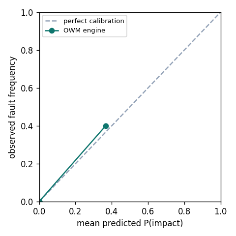

# Org World Model (OWM)

*A causal world model that learns a system's blast radius — and beats a stateless LLM at predicting it.*

[](https://github.com/swapnildahiphale/org-world-model/actions/workflows/ci.yml)
[](LICENSE)


**Claim under test:** for predicting the *consequences* of a software change, a model over a
**joined causal graph** (code ↔ services ↔ deploys ↔ incidents) beats a **stateless LLM** reasoning
over the same context as text — and, unlike the LLM, it **deepens**: each incident that exposes a
hidden dependency permanently improves its next prediction.

A deliberately small, self-contained experiment behind one idea: the durable thing a senior engineer
carries isn't the *observable* code (an LLM can approximate that) but a **causal model of how this
specific system behaves** — what breaks if you touch X — that **deepens over time** from what
actually happens to the system. A retrieval/RAG harness can fetch the observable layer; it
structurally cannot deepen on consequences.

> Not a product. A crisp, reproducible experiment that makes one hard claim falsifiable on a real
> microservice topology.

---

## What it does

On Google's **Online Boutique** (11-service microservices demo) the project:

1. **Builds the join** — one graph linking `commit → file → service → deploy → incident`, seeded
   from the repo's real structure (static code parse + service topology).
2. **Answers `do(change)`** — given a proposed change to a file/service, forward-propagates over the
   weighted graph to a **ranked, probabilistic blast radius** ("these services are at risk, in this
   order, with these probabilities").
3. **Beats a stateless baseline** — hands a strong LLM the *same* context as text (topology + diff +
   logs) and scores both against ground-truth fault propagation (Brier score / calibration).
4. **Deepens** — injects a fault that exposes a dependency **missing** from the static graph; the
   model learns the edge; a similar later change now catches the previously-missed service. The LLM,
   given the same logs, does not persist the lesson. **We plot the before/after curve.**

## Why it matters (the one-line version)

`world model = stateful, action-conditioned, causal predictor` ≠ `retrieval = stateless lookup`.
This project is the smallest artifact that shows the difference is real, not rhetorical.

---

## Status

Built and tested — **55 tests pass** — and the live cluster run is **complete**. The thesis holds.

### Implemented and tested

- [x] `owm/graph.py` — typed causal graph: given/learned provenance, CONFIG nodes, COUPLES relation
- [x] `owm/codegraph.py` — language-agnostic static parse of Online Boutique manifests → services, call edges, config knobs, ownership, productcatalog endpoints
- [x] `owm/topology.py` — seeds the graph with naive Beta(1,1) priors (GIVEN provenance only)
- [x] `owm/propagate.py` — noisy-OR `do(change, s_t)` with mitigating controls and state gating
- [x] `owm/learn.py` — Beta-posterior updates + surprise-gated HIDDEN edge addition + `learning_enabled` ablation flag
- [x] `owm/scenarios.py` — TEACH / TRANSFER / NEGATIVE scenario family, grounded on genuinely-parsed config knobs
- [x] `owm/context.py` — symmetric context bundle shared by engine and LLM baselines
- [x] `owm/engine.py` — OWMEngine predictor
- [x] `owm/baselines.py` — stateless LLM, RAG LLM, BFS, FakeClient, and lazy live client
- [x] `owm/eval.py` — provenance-stratified Brier, equal-frequency reliability diagram, deepening curve, state_delta, plots
- [x] `owm/groundtruth.py` — Prediction + GroundTruth schema
- [x] `groundtruth/` package — RCAEval loader, journey-probe aggregator, `inject.md` live-injection runbook
- [x] `scripts/run.py` — `--offline` and `--full` modes
- [x] `scripts/check_wins.py` and `scripts/assemble_ground_truth.py`
- [x] `PREREGISTRATION.md` + frozen `scenarios.json` (hash recorded in pre-registration)

### Roadmap

- [x] **Live run** — deployed Online Boutique on a real EKS cluster, ran fault injections (see `groundtruth/inject.md`), scored engine vs. real LLM. Results in [RESULTS.md](RESULTS.md).
- [ ] **Abstention / risk–coverage / AURC** (uses Beta-posterior variance) — specified in pre-registration, NOT implemented — Week-2.
- [ ] **k-fold over ≥6 hidden edges, bootstrapped calibration CIs** — Week-2.
- [ ] **Web view** — deferred.

---

## Results

On Google's Online Boutique deployed to a real EKS cluster, we injected a hidden latency coupling
(`EXTRA_LATENCY` on productcatalogservice) and **measured** the blast radius from distributed
traces — it was not authored. Measured blast set D = {frontend, recommendationservice}
(checkoutservice was checked and empirically excluded).

Against **real Opus** (claude-opus-4-8, n=5 self-consistency), HIDDEN-stratum Brier (lower is better):

| predictor | HIDDEN Brier |
|---|---:|
| **OWM engine** (after learning 1 incident) | **0.013** |
| Opus + RAG (handed the incident history) | 0.027 |
| BFS topology walk / engine before learning | 0.083 |
| stateless Opus | 0.127 |

Deepening: engine **0.083 → 0.013** after one incident; the learning-disabled ablation stays flat at
0.083. All four pre-registered win conditions pass.



Full methodology, honest limits, and reproduce steps: see [RESULTS.md](RESULTS.md).

---

## Installation

```bash
pip install -e .            # core (graph + propagation + eval)
pip install -e ".[llm]"     # + Anthropic / OpenAI clients for the live LLM baselines
pip install -e ".[dev]"     # + pytest
```

---

## Quickstart

```bash
# 1 — run all 55 tests
.venv/bin/python -m pytest -q

# 2 — M1 stratified Brier (offline; baselines are stubs)
.venv/bin/python -m scripts.run --offline

# 3 — full predictor matrix, offline
#     NOTE: baselines are a canned stub LLM — this is NOT a real engine-vs-LLM contest
.venv/bin/python -m scripts.run --full --offline

# 4 — check win conditions against saved results
.venv/bin/python -m scripts.check_wins results/results.json

# 5 — live run (needs your cluster + API key; see groundtruth/inject.md)
# groundtruth/inject.md
```

---

## What the offline numbers mean

Running `--full --offline` produces real metrics on the **engine's own learning**, where baselines
are a canned stub (not a real LLM call):

- **Deepening signal (honest):** HIDDEN-stratum Brier improves from `engine_pre 0.25` → `engine
  0.02` after learning one incident; the learning-disabled ablation stays flat at 0.25. That
  before/after gap — and the ablation being flat — is the real offline signal.
- **Engine-vs-LLM is NOT meaningful offline.** The LLM baseline is a stub; the real comparison
  requires the live run with a genuine LLM (see `groundtruth/inject.md`). Live results: [RESULTS.md](RESULTS.md).

The design is **metric-first**: claim, win conditions, and scenario hash are frozen in
`PREREGISTRATION.md` before any live scoring.

---

## Design notes

The representation here is **graph-grounded** — an explicit causal graph is the model; any LLM sits
only at the interface. That's the most tractable way to get causal, intervention-capable,
*deepening* behavior with a week of effort. It is a starting hypothesis, not a commitment: a learned
world model or a specialized/fine-tuned LLM is a plausible later substrate, and the demo's *claim
and metrics are designed to survive swapping the engine underneath*.

## License

MIT — see [LICENSE](LICENSE).
