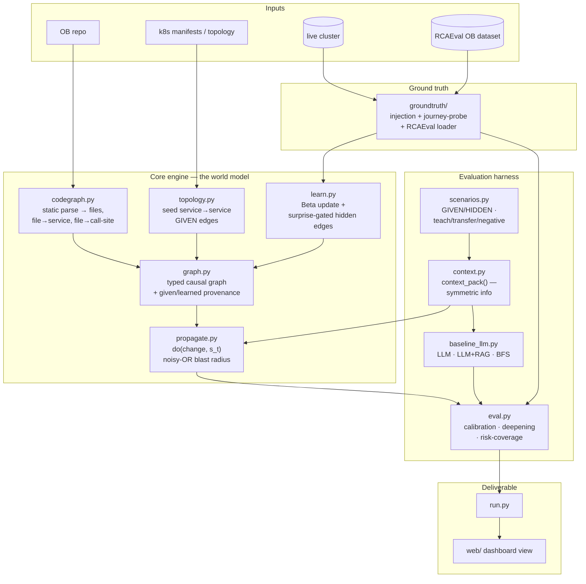
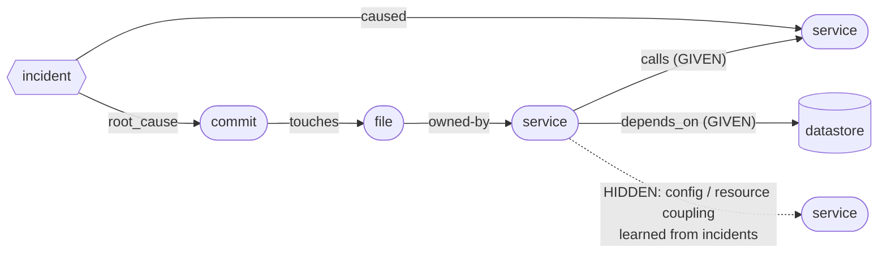
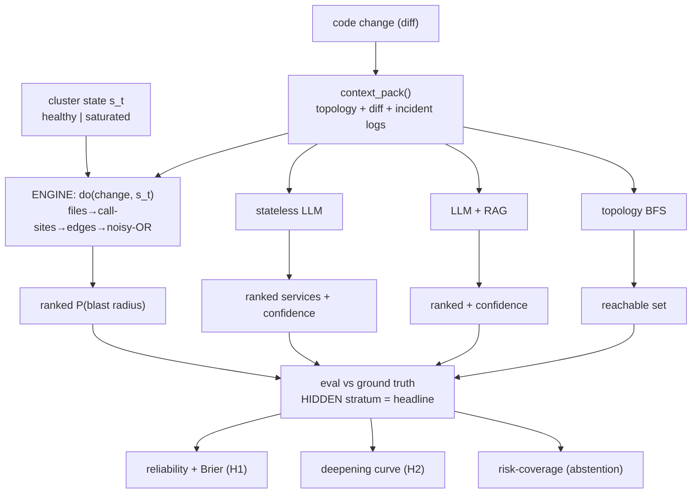
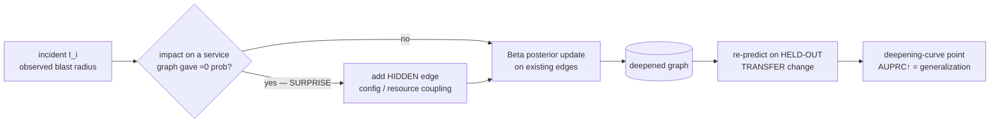
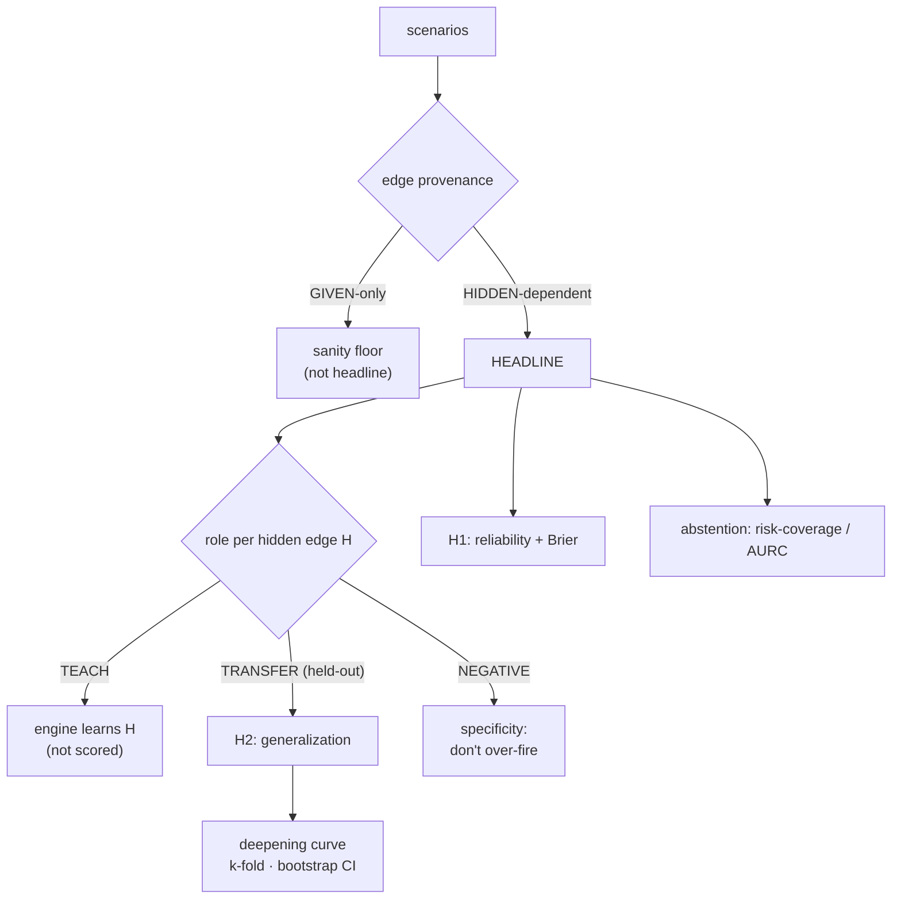
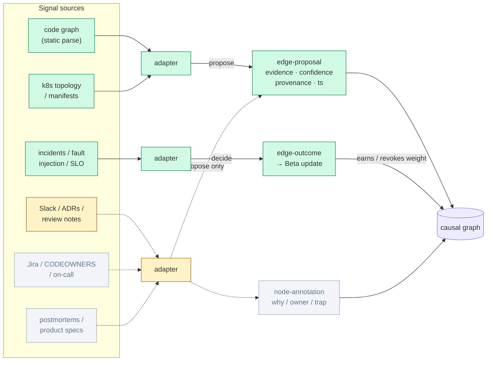

# Architecture diagrams — Org World Model (OWM)

Source-of-truth diagrams (Mermaid, render on GitHub). A rendered view lives in `docs/diagrams.html`.

**Legend:** solid edges = `GIVEN` (static-parseable structure we seed). Dashed edges = `HIDDEN`
(real couplings the engine must *learn* from incidents — never scored against until learned).

---

## What this is & why

Today's AI coding tools are effectively *stateless decoders* — they pattern-match text but have **no model of your actual running system**, so they can't reliably answer *"what breaks if I change this?"* and they don't learn from your incidents. This project builds a small **causal world model** that does. It shows — on a real microservice app (Online Boutique) — that a graph-based causal model beats a plain LLM at predicting the consequences of a code change, **and** gets smarter from each incident.

## Vocabulary

- **OB = Online Boutique** — Google's open-source [microservices demo](https://github.com/GoogleCloudPlatform/microservices-demo):
  a toy e-commerce site, **11 services** (frontend, cart, checkout, productcatalog, currency,
  payment, shipping, email, recommendation, ads) + a Redis cache + a load generator. Polyglot,
  deploys on k8s in ~15 min. Our stand-in "real system" to model.
- **Blast radius** — when you ship a change to service S, *which other services break/degrade* as a
  consequence. The literal "what breaks if you touch X."
- **The "join"** — stitching three normally-separate things into one graph: (1) **code** (files,
  who-calls-what), (2) **runtime topology** (which service calls which), (3) **incident history**
  (what actually broke when). Nobody fuses these today — the novel bit.
- **GIVEN vs HIDDEN edges** — GIVEN = connections any static tool reads straight from the code
  ("frontend calls cart"). HIDDEN = *real* couplings the code does **not** reveal (two services
  quietly contending on the same Redis; a config flag that silently slows another service). **The
  honesty rule:** we only grade the model on HIDDEN couplings it had to *learn* — beating an LLM on
  GIVEN structure we handed it would be cheating.
- **Calibration** — when the model says "70% chance this breaks," does it break ~70% of the time?
  LLMs are *confidently wrong*; a good probabilistic model's confidence matches reality. Headline #1.
- **Deepening** — the model permanently improves from each incident (learns a coupling it didn't
  know); the LLM doesn't retain that across questions. Headline #2.
- **s_t (state)** — the cluster's current condition (healthy vs. already overloaded). The *same*
  change can have a *different* blast radius depending on state — a world model captures that; a
  static graph or stateless LLM cannot. The "money shot."
- **noisy-OR** — standard, simple math to combine probabilities when something can break via
  *multiple* paths. The propagation rule.
- **Beta update / "surprise-gated"** — a standard way to nudge a probability toward what you observe,
  incident by incident; "surprise-gated" = only learn from events that *surprised* the model (it
  said safe, reality said broken), not from boring confirmations.

---

## 1. System architecture / components

**In plain English:** the boxes are the code modules we'll write. Read left-to-right by *layer*:
**Inputs** (the OB repo, its k8s manifests, your live cluster, the RCAEval fault dataset) feed the
**Core engine** (parses the code, builds the seed graph, answers `do(change)` predictions); the
**Evaluation harness** runs the same questions through both our engine and the LLM baselines and
scores them against **Ground truth**; results flow to the **Deliverable** (a demo runner + the web
view). One-liner: *inputs → build the model → predict → score engine vs. LLM → show it.*

---

## 2. The join graph schema (the world model itself)

**In plain English:** this is the *shape of the world model itself* — the data structure. A `commit`
**touches** `file`s, a file is **owned by** a `service`, services **call** other services (and
**depend on** a `datastore`), and an `incident` **caused** damage to a service and traces to a
root-cause commit. **Solid** arrows are GIVEN (readable from code); the **dashed** arrow is a HIDDEN
coupling the engine must *learn*. One-liner: *code, runtime, and incidents in one connected graph.*

---

## 3. Prediction data-flow (engine vs. baselines, symmetric context)

**In plain English:** how a *single* prediction happens. A code change (+ the cluster state `s_t`)
goes into our **engine**; the **exact same information, as text**, goes into the **LLM baselines**
(plain LLM, LLM+retrieval, and a dumb graph-walk). Each produces a ranked "here's what'll break"
list. **Eval** scores them all against ground truth — *but only the HIDDEN cases are the headline* —
and emits the three result types: calibration, the deepening curve, and abstention. One-liner:
*same question to engine and LLM, fair fight, judged on the hard cases.*

---

## 4. The learning / deepening loop (the H2 story)

**In plain English:** how the model gets smarter. An incident arrives. **Did it surprise the model**
(break something it thought was safe)? If yes → the model **adds a hidden edge** (it just discovered
a coupling). If no → it just **updates the probability** on an edge it already knew. Then —
crucially — we **re-test on a *different but related* change** it hasn't seen, to prove it learned
the *general lesson*, not memorized one incident. That after-learning score is a point on the
deepening curve. One-liner: *incident → learn the coupling → prove it generalizes.*

---

## 5. The evaluation protocol (how we stay honest)

**In plain English:** how we stay honest (mostly guardrails). Split every test scenario by **GIVEN
vs HIDDEN** — only HIDDEN is the headline. For each hidden coupling, changes get one of three
**roles**: **TEACH** (the model may learn from these), **TRANSFER** (held-out — the *real* test of
whether it learned), and **NEGATIVE** (look-alike changes that should *not* trigger it, proving it's
not just over-reacting). Those feed the deepening curve, the calibration result, and the abstention
("knows when to ask") result. One-liner: *judge only on what it had to learn, and only on examples
it never saw.*

---

## 6. Signal ingestion layer (extensible)

**In plain English:** many signal sources feed the model through adapters. Structural and decision
signals can *propose* edges, but **only outcome signals (incidents/faults) grant causal weight** —
that rule is what keeps it a world model, not retrieval-over-Slack. Colors: green = built in the
demo, amber = illustrative stub, grey = future adapters behind the same interface. One-liner:
*decision-signals propose, outcomes decide.*
